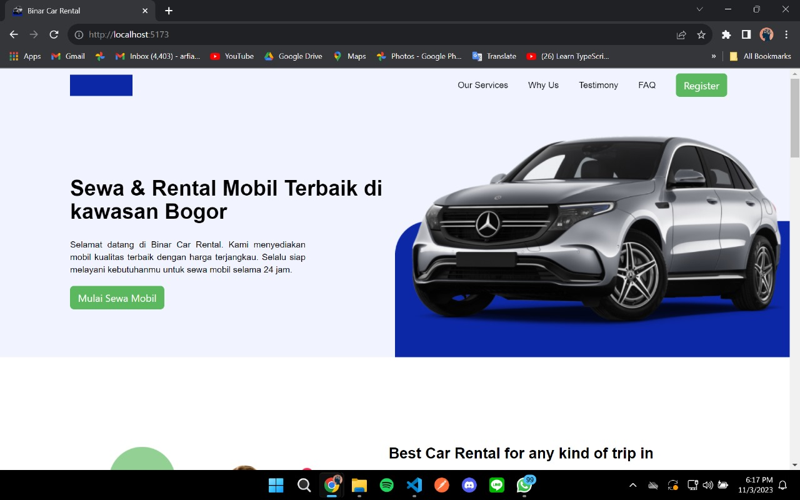
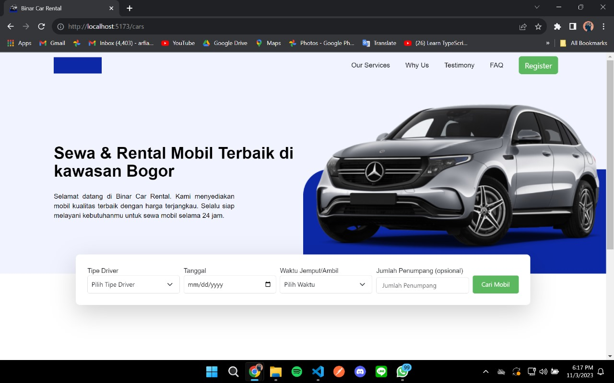
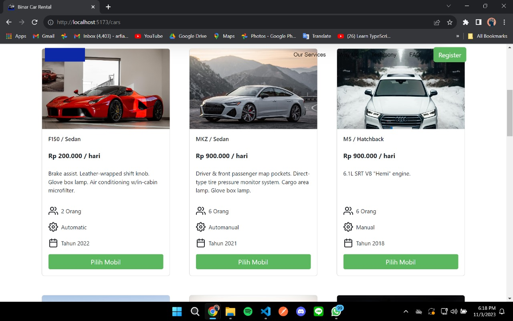

# Challenge Chapter 06 FSW Binar Academy x KM Batch 5

This project is for completing chapter 6 challenge "Binar Car Rental" using React.

## Run Locally

Clone the project

```bash
  git clone https://github.com/ukinon/Challenge-Chapter-6-React.git
```

Go to the project directory

```bash
  cd Challenge-Chapter-06
```

Install dependencies

```bash
  npm install
```

Start the server

```bash
  npm run dev
```

## Pages

#### Landing Page



#### Rent Car Page



#### Car List


